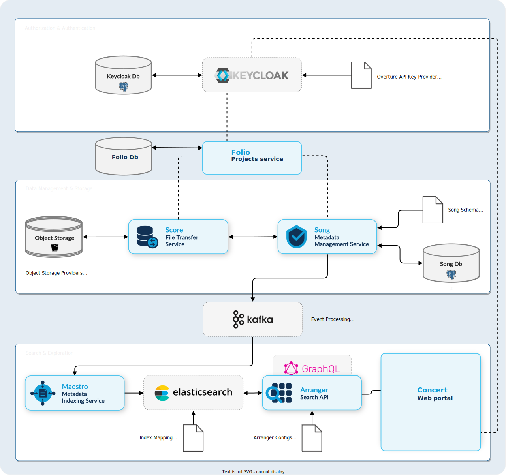

# Agari-Folio

Agari-Folio adds Agari features to Overture Genomics Data stack, providing robust project management and granular role-based access control for genomics data workflows.



## Features

- Project and study management
- Fine-grained permissions and roles
- Organization and user management
- RESTful API with JWT authentication
- Integration with Keycloak for identity management
- Proxy for Overture services (SONG and SCORE)

## API Documentation

Interactive API documentation (Swagger UI) is available at:

```
http://<your-host>:<port>/docs
```

Replace `<your-host>` and `<port>` with your deployment details.

## Proxy for Overture Services SONG and SCORE

This service also acts as a proxy for the Overture services SONG and SCORE, facilitating secure and authenticated access to these services through Agari-Folio's permission system.

## Development

Create a virtual environment and activate it.

Install python dependencies:

```
pip install -U  --upgrade-strategy=eager -r requirements.txt
```

Install [mjml](https://documentation.mjml.io/#installation)

Configure environment variables for accessing backing services (see settings.py)

Run folio

```
python app.py
```

## Tests

To run/dev tests locally, start the backing services (postgres, keycloak) using docker-compose, then configure your environment variables for folio to speak to them.


```
docker compose up
```

Wait for the services to be ready

and run tests

```
pytest
```


### Pytest

- fixtures go in conftest.py
- fixtures are invoked as argument names to test functions
- test module names start with test_
- fixtures can clean up by yielding their value - pytest will call next to invoke the cleanup
  code after the fixture's scope ends.
